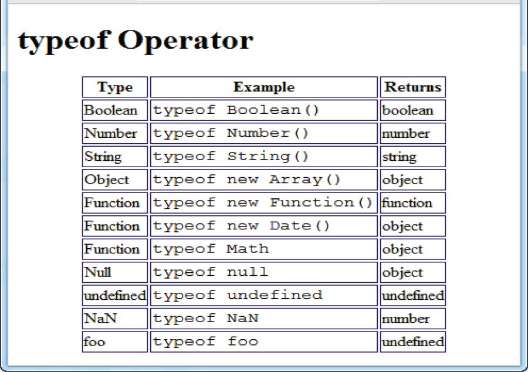
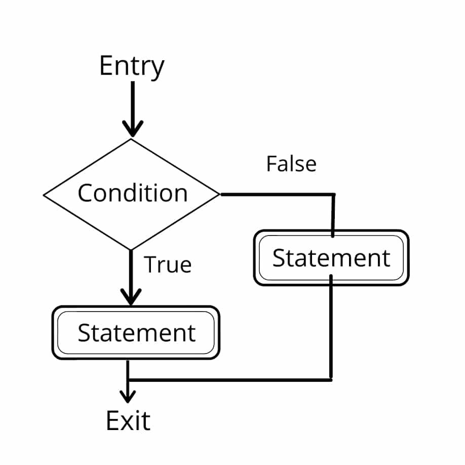
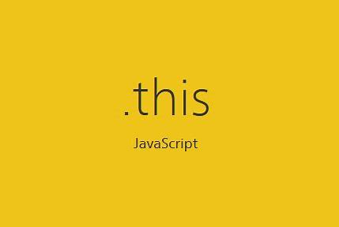

# 1.- ¿Qué diferencia a JavaScript de otros lenguajes de programación?


JavaScript es uno de los lenguajes de programación más populares en el mundo, pero ¿qué lo hace especial? A diferencia de lenguajes como Python, Java o C++, JavaScript tiene características que lo hacen único, especialmente en el desarrollo web.

## 1.1.- JavaScript se ejecuta en el navegador

La mayoría de los lenguajes de programación requieren un **intérprete** o un **compilador** para ejecutarse. JavaScript, en cambio, **se ejecuta directamente en el navegador** sin configuraciones adicionales.

#### **Ejemplo práctico:**
Cuando un usuario abre una página web, el navegador descarga y ejecuta el código JavaScript automáticamente.

```html
<!DOCTYPE html>
<html>
<head>
    <title>Ejemplo de JavaScript</title>
</head>
<body>
    <p id="mensaje">Hola, mundo.</p>
    <button onclick="cambiarTexto()">Haz clic aquí</button>

    <script>
        function cambiarTexto() {
            document.getElementById("mensaje").innerText = "¡Texto cambiado!";
        }
    </script>
</body>
</html>
```

Aquí, JavaScript modifica el contenido de la página sin necesidad de recargarla, lo que no es posible con lenguajes como C++ o Java.

### Flujo de ejecución de JavaScript en el navegador

```txt
+-----------------+
| Página Web HTML |
+-----------------+
        |
        ▼
+-------------------+
| Motor JavaScript  |
| (Ejecuta código)  |
+-------------------+
        |
        ▼
+---------------------+
| DOM (Modifica la UI)|
+---------------------+
```


## 1.2.- JavaScript es un lenguaje interpretado

A diferencia de Java, que requiere compilarse antes de ejecutarse, JavaScript es interpretado. Esto significa que el navegador ejecuta el código línea por línea.

Ventajas:

- Más rápido en desarrollo → No necesitas compilar el código antes de probarlo. 
- Ideal para desarrollo web → Puedes ver los resultados de inmediato en el navegador. 
- Mayor flexibilidad → Puedes escribir código en cualquier editor sin necesidad de herramientas complejas.

#### **Ejemplo comparativo:**
```java

public class HolaMundo {
    public static void main(String[] args) {
        System.out.println("Hola, mundo.");
    }
}
```

En Java, primero debes compilar el código con javac HolaMundo.java antes de ejecutarlo con java HolaMundo.

#### **JavaScript (Interpretado):**
```js
console.log("Hola, mundo.");
```

En JavaScript, basta con escribirlo y ejecutarlo en el navegador o en la consola.

### Lenguaje compilado vs interpretado

Lenguaje Compilado (Java, C++)

```txt
+---------+       +--------+      +--------+
| Código  | ---> | Compilar| ---> | Ejecutar|
+---------+       +--------+      +--------+

Lenguaje Interpretado (JavaScript)

+---------+       +--------+
| Código  | ---> | Ejecutar |
+---------+       +--------+
```


## 1.3.- JavaScript tiene un tipado dinámico

En lenguajes como Java o C++, debes especificar el tipo de cada variable (int, string, boolean, etc.). En JavaScript, puedes cambiar el tipo de una variable en cualquier momento.

#### **Ejemplo de tipado dinámico:**
```js
let dato = "Hola";  
dato = 42;         
console.log(dato);  
```

En lenguajes como Java, esto generaría un error.

✔️ Ventajas: Mayor flexibilidad en el manejo de datos. 
❌ Desventajas: Puede causar errores difíciles de detectar.

### Comparación: Tipado dinámico vs estático

```txt
JavaScript (Tipado dinámico)
---------------------------------
let x = "Hola";   // x es un string
x = 42;           // Ahora x es un número

Java (Tipado estático)
---------------------------------
int x = 42;    // x solo puede ser un número
x = "Hola";    // ERROR ❌ No se puede cambiar el tipo
```


## 1.4.- JavaScript es multi-paradigma

JavaScript permite programar usando diferentes paradigmas, a diferencia de lenguajes que están limitados a uno solo: 

- Programación funcional 
- Programación orientada a objetos 
- Programación basada en eventos

#### **Ejemplo de programación funcional en JavaScript:**

```js
const suma = (a, b) => a + b;
console.log(suma(5, 3));  // Salida: 8
```
Este enfoque se usa en librerías como React.js.

## 1.5.- JavaScript es el estándar de la web

JavaScript no tiene competencia en desarrollo web. Todos los navegadores modernos lo soportan de manera nativa, lo que significa que: 

- Puedes hacer sitios interactivos sin necesidad de herramientas extra. 
- Existen frameworks populares como React, Angular y Vue. 
- También puede usarse en el backend con Node.js..

#### **Ejemplo de un servidor con Node.js:**
```js
const http = require("http");

const server = http.createServer((req, res) => {
    res.writeHead(200, {"Content-Type": "text/plain"});
    res.end("¡Hola desde el servidor!");
});

server.listen(3000, () => {
    console.log("Servidor corriendo en el puerto 3000");
});
```

Con Node.js, puedes usar JavaScript para crear servidores web sin necesidad de aprender otro lenguaje.

#### **Conclusión:**

JavaScript se diferencia de otros lenguajes porque: 

- Se ejecuta en el navegador sin compilación previa. 
- Es interpretado, lo que facilita el desarrollo rápido. 
- Tiene tipado dinámico, lo que le da flexibilidad. 
- Permite múltiples paradigmas de programación. 
- Es el lenguaje estándar de la web.


# 2.- ¿Cuáles son algunos tipos de datos en JavaScript?




JavaScript tiene un sistema de **tipado dinámico**, lo que significa que no es necesario declarar el tipo de una variable antes de asignarle un valor. Sin embargo, los datos en JavaScript se clasifican en **tipos primitivos** y **tipos de objetos**.

## 2.1.- Tipos de datos primitivos

Los **tipos primitivos** son los más básicos en JavaScript. Son inmutables, lo que significa que su valor no puede ser cambiado directamente.

### **Tipos primitivos en JavaScript:**

- `String` → Cadenas de texto
- `Number` → Números
- `Boolean` → Verdadero o falso
- `Undefined` → Variable sin valor asignado
- `Null` → Valor vacío o inexistente
- `BigInt` → Números muy grandes
- `Symbol` → Valores únicos para identificar datos

#### **Ejemplo de cada tipo primitivo:**

```js
let texto = "Hola, mundo";  // String
let numero = 42;            // Number
let esVerdadero = true;      // Boolean
let sinDefinir;              // Undefined (valor no asignado)
let vacio = null;            // Null (valor vacío)
let numeroGrande = 12345678901234567890n; // BigInt
let simbolo = Symbol("identificador"); // Symbol
```

### Tipos primitivos en JavaScript:

```txt
+-----------+----------------------+
| Tipo      | Ejemplo              |
+-----------+----------------------+
| String    | "Hola, mundo"        |
| Number    | 42                   |
| Boolean   | true / false         |
| Undefined | let x;               |
| Null      | let y = null;        |
| BigInt    | 12345678901234567890n|
| Symbol    | Symbol("id")         |
+-----------+----------------------+
```

## 2.2.- Tipos de datos de objetos

Los tipos de objetos pueden almacenar múltiples valores y poseen métodos y propiedades.

Tipos de objetos en JavaScript:

- Object → Estructura clave-valor

- Array → Lista ordenada de elementos

- Function → Código reutilizable

- Date → Fechas y horas

- RegExp → Expresiones regulares

- Map y Set → Estructuras de datos avanzadas

#### **Ejemplo de cada tipo de objeto:**

```js
let persona = { nombre: "Lorena", edad: 25 };  // Object
let lista = [1, 2, 3, 4, 5];                   // Array
function suma(a, b) { return a + b; }          // Function
let fecha = new Date();                         // Date
let regex = /abc/i;                            // RegExp
let mapa = new Map([["nombre", "Lorena"], ["edad", 25]]); // Map
let conjunto = new Set([1, 2, 3, 4, 5]);       // Set
```

### Tipos de objetos en JavaScript:

```txt
+-----------+----------------------------------+
| Tipo      | Ejemplo                          |
+-----------+----------------------------------+
| Object    | { nombre: "Lorena", edad: 25 }  |
| Array     | [1, 2, 3, 4, 5]                  |
| Function  | function suma(a, b) { return a+b } |
| Date      | new Date()                        |
| RegExp    | /abc/i                            |
| Map       | new Map([["nombre", "Lorena"]])  |
| Set       | new Set([1, 2, 3, 4, 5])         |
+-----------+----------------------------------+
```

## 2.3.- Conversión de tipos

JavaScript permite convertir datos de un tipo a otro de manera implícita y explícita.

#### **Conversión implícita:**

Cuando JavaScript cambia automáticamente el tipo de una variable.

#### **Ejemplo de conversión implícita:**

```js
let resultado = "5" + 3;  // Se convierte en "53" (string)
console.log(typeof resultado); // "string"

```

#### **Conversión explícita:**

Cuando el programador decide cambiar el tipo manualmente.

#### **Ejemplo de conversión explícita:**

```js
let numero = "42";
let convertido = Number(numero); // Se convierte a número
console.log(typeof convertido); // "number"
```

#### **Conclusión:**

JavaScript tiene dos tipos principales de datos:

- Primitivos → Son básicos e inmutables.

- Objetos → Son estructuras complejas con múltiples valores y métodos.

También permite conversiones de tipos, lo que lo hace flexible para el desarrollo.


# 3.- ¿Cuáles son las tres funciones de String en JavaScript?

Las **cadenas de texto (`String`)** en JavaScript son un tipo de dato primitivo que permite almacenar y manipular texto. JavaScript ofrece múltiples funciones para trabajar con cadenas, pero aquí veremos **tres de las más utilizadas**.


## 3.1.- `.length`: Obtener la longitud de una cadena

La propiedad `.length` permite obtener **el número de caracteres** en una cadena, incluyendo espacios y símbolos.

#### **Ejemplo de `.length`**
```js
let mensaje = "Hola, mundo!";
console.log(mensaje.length); // Salida: 13
```

## 3.2.- .toUpperCase(): Convertir una cadena a mayúsculas

La función .toUpperCase() transforma todos los caracteres de una cadena a mayúsculas.

#### **Ejemplo de .toUpperCase():**

```js
let texto = "javascript es genial";
console.log(texto.toUpperCase()); // Salida: "JAVASCRIPT ES GENIAL"
```

## 3.3.- .replace(): Reemplazar parte de una cadena

La función .replace() permite buscar una palabra en la cadena y sustituirla por otra.

#### **Ejemplo de .replace():**
```js
let frase = "Aprender JavaScript es divertido";
let nuevaFrase = frase.replace("divertido", "increíble");
console.log(nuevaFrase); // Salida: "Aprender JavaScript es increíble"
```

### **Resumen de funciones de String en JavaScript:**

```txt
+-----------------+--------------------------------------+
| Función         | Descripción                          |
+-----------------+--------------------------------------+
| .length        | Obtiene la cantidad de caracteres     |
| .toUpperCase() | Convierte la cadena a mayúsculas      |
| .replace()     | Sustituye una palabra por otra        |
+-----------------+--------------------------------------+
```

#### **Conclusión:**

Las cadenas en JavaScript permiten manipular texto de diversas formas. Las tres funciones más usadas son:

- length → Obtiene el número de caracteres de la cadena.

- toUpperCase() → Convierte la cadena a mayúsculas.

- replace() → Reemplaza parte de la cadena por otro texto.


# 4.- ¿Qué es un condicional en JavaScript?



Los **condicionales** en JavaScript permiten ejecutar diferentes fragmentos de código **según una condición específica**. Son esenciales para **tomar decisiones** dentro de un programa.


## 4.1.- Tipos de condicionales en JavaScript

JavaScript ofrece varios tipos de estructuras condicionales:

- `if` → Evalúa una condición y ejecuta el código si es **verdadera**.
- `if...else` → Agrega una alternativa si la condición es **falsa**.
- `else if` → Permite evaluar múltiples condiciones.
- `switch` → Evalúa una variable contra **múltiples casos**.


## 4.2.- Condicional `if`

La estructura `if` **ejecuta el bloque de código** si la condición es **verdadera**.

#### **Ejemplo de `if`:**
```js
let edad = 18;

if (edad >= 18) {
    console.log("Eres mayor de edad.");
}
```

## 4.3.- Condicional if...else

El condicional if...else agrega una alternativa en caso de que la condición no se cumpla.

#### **Ejemplo de if...else:**
```js
let hora = 14;

if (hora < 12) {
    console.log("Buenos días.");
} else {
    console.log("Buenas tardes.");
}
```

## 4.4.- Condicional else if

El condicional else if permite manejar múltiples condiciones.

#### **Ejemplo de else if:**

```js
let nota = 85;

if (nota >= 90) {
    console.log("Excelente.");
} else if (nota >= 70) {
    console.log("Aprobado.");
} else {
    console.log("Reprobado.");
}
```

## 4.5.- Condicional switch

El condicional switch evalúa múltiples opciones.

#### **Ejemplo de switch:**
```js
let dia = "lunes";

switch (dia) {
    case "lunes":
        console.log("Inicio de semana.");
        break;
    case "viernes":
        console.log("Casi fin de semana.");
        break;
    default:
        console.log("Día normal.");
}
```

###  **Diferencias entre condicionales en JavaScript:**

```txt
+-----------+------------------------------------+
| Condición | Acción                             |
+-----------+------------------------------------+
| if        | Ejecuta un bloque si es verdadero |
| if...else | Agrega una alternativa            |
| else if   | Maneja múltiples condiciones      |
| switch    | Compara con varios valores        |
+-----------+------------------------------------+
```

#### **Conclusión:**

Los condicionales en JavaScript permiten tomar decisiones en el código. Los más comunes son:

- if → Evalúa una condición.

- if...else → Agrega una alternativa.

- else if → Evalúa múltiples opciones.

- switch → Maneja casos específicos.


# 5.- ¿Qué es un operador ternario en JavaScript?

El **operador ternario (`? :`)** es una forma compacta de escribir una expresión condicional en JavaScript. Se utiliza como una alternativa más corta al **`if...else`**, facilitando la lectura y escritura del código.

## 5.1.- Sintaxis del operador ternario

La estructura del operador ternario es la siguiente:

```txt
condición ? valor_si_verdadero : valor_si_falso;
```

## 5.2.- Ejemplo básico de operador ternario

El siguiente código determina si una persona es mayor de edad:

```js
let edad = 18;
let mensaje = edad >= 18 ? "Eres mayor de edad" : "Eres menor de edad";

console.log(mensaje); // Salida: "Eres mayor de edad"
```

## 5.3.- Uso del operador ternario dentro de una función

El operador ternario se puede utilizar dentro de funciones para simplificar el retorno de valores:

```js
function verificarAcceso(edad) {
    return edad >= 18 ? "Acceso permitido" : "Acceso denegado";
}

console.log(verificarAcceso(21)); // Salida: "Acceso permitido"
console.log(verificarAcceso(16)); // Salida: "Acceso denegado"
```

## 5.4.- Anidación de operadores ternarios

Se pueden encadenar múltiples operadores ternarios, aunque se recomienda no abusar de esta práctica para evitar que el código sea difícil de leer.

```js
let puntuacion = 85;
let resultado = puntuacion >= 90 ? "Excelente" 
               : puntuacion >= 70 ? "Aprobado" 
               : "Reprobado";

console.log(resultado); // Salida: "Aprobado"
```

### **Uso del operador ternario en JavaScript:**

```txt
+----------------------+----------------------------------+
| Expresión            | Equivalente en if...else        |
+----------------------+----------------------------------+
| x > 10 ? "Mayor" : "Menor" | if(x > 10){ "Mayor"; } else { "Menor"; } |
| edad >= 18 ? "Adulto" : "Niño" | if(edad >= 18){ "Adulto"; } else { "Niño"; } |
+----------------------+----------------------------------+
```

#### **Conclusión:**

El operador ternario en JavaScript:

- Sustituye el if...else en una única línea de código.

- Mejora la legibilidad cuando las condiciones son simples.

- Puede encadenarse, aunque hay que usarlo con moderación.


# 6.- ¿Cuál es la diferencia entre una declaración de función y una expresión de función en JavaScript?

En JavaScript, existen dos maneras principales de definir funciones: **declaración de función** y **expresión de función**.  
Ambas permiten crear funciones reutilizables, pero tienen diferencias clave en cómo se ejecutan y se almacenan en memoria.


## 6.1.- Declaración de función

Una **declaración de función** se define utilizando la palabra clave `function` y tiene un **nombre obligatorio**.

#### **Ejemplo de declaración de función:**
```js
function saludar(nombre) {
    return "Hola, " + nombre;
}

console.log(saludar("Lorena")); // Salida: "Hola, Lorena"
```

## 6.2.- Expresión de función

Una expresión de función asigna una función a una variable y no requiere un nombre.

#### **Ejemplo de expresión de función:**

```js
const saludar = function(nombre) {
    return "Hola, " + nombre;
};

console.log(saludar("Lorena")); // Salida: "Hola, Lorena"
```

### **Características principales de la expresión de función:**

- No se almacena en memoria hasta que el código llega a su definición.

- No se puede llamar antes de su declaración (no tiene hoisting).

- Puede ser anónima (sin nombre propio).

### **Diferencias entre declaración y expresión de función**

```txt
+------------------------+---------------------------------+
| Característica         | Declaración de función         |
+------------------------+---------------------------------+
| Sintaxis               | function nombre() {}           |
| Nombre requerido       | Sí                              |
| Hoisting (antes de definir) | Sí                     |
| Se almacena en memoria | Antes de ejecutar el código    |
+------------------------+---------------------------------+
| Característica         | Expresión de función           |
+------------------------+---------------------------------+
| Sintaxis               | const nombre = function() {}   |
| Nombre requerido       | No (puede ser anónima)         |
| Hoisting (antes de definir) | No                     |
| Se almacena en memoria | Solo cuando se ejecuta        |
+------------------------+---------------------------------+
```

#### **Conclusión:**

Las diferencias clave entre declaraciones de función y expresiones de función son:

- Las declaraciones tienen un nombre obligatorio y se cargan antes de ejecutar el código.

- Las expresiones pueden ser anónimas y solo se almacenan cuando se ejecutan.

- Las declaraciones tienen hoisting, las expresiones no.


# 7.- ¿Qué es la palabra clave `this` en JavaScript?



La palabra clave **`this`** en JavaScript **hace referencia al contexto de ejecución actual**. Su valor cambia dependiendo de **cómo** y **dónde** se usa en el código.


## 7.1.- `this` en el contexto global

Cuando `this` se usa en el **contexto global**, se refiere al **objeto global** (`window` en el navegador o `global` en Node.js).

#### **Ejemplo en el contexto global:**

```js
console.log(this); // En un navegador, imprime el objeto `window`
```

## 7.2.- this dentro de un objeto

Cuando this se usa dentro de un objeto, hace referencia al propio objeto.

#### **Ejemplo de this dentro de un objeto:**

```js
const usuario = {
    nombre: "Lorena",
    saludar: function() {
        return "Hola, " + this.nombre;
    }
};

console.log(usuario.saludar()); // Salida: "Hola, Lorena"
```

## 7.3.- this en funciones normales

Cuando this se usa en una función, depende de cómo se llama la función.

#### **Ejemplo de this en una función normal:**

```js
function mostrarThis() {
    console.log(this);
}

mostrarThis(); // En un navegador, imprime `window`
```

## 7.4.- this en funciones flecha (=>)

Las funciones flecha (=>) tienen un comportamiento especial: no crean su propio this, sino que heredan el valor de this del contexto superior.

#### **Ejemplo de this en una función flecha:**

```js
const usuario = {
    nombre: "Lorena",
    saludar: () => {
        return "Hola, " + this.nombre;
    }
};

console.log(usuario.saludar()); // Salida: "Hola, undefined"
```

## 7.5.- this con call(), apply() y bind()

JavaScript permite controlar manualmente el valor de this usando métodos especiales:

- call() → Ejecuta una función con un valor específico de this.

- apply() → Similar a call(), pero los argumentos se pasan en un array.

- bind() → No ejecuta la función, sino que crea una nueva función con un this fijo.


#### **Ejemplo de this con call(), apply() y bind()**

```js
function saludar() {
    console.log("Hola, " + this.nombre);
}

const persona = { nombre: "Lorena" };

saludar.call(persona);  // Salida: "Hola, Lorena"
saludar.apply(persona); // Salida: "Hola, Lorena"

const nuevaFuncion = saludar.bind(persona);
nuevaFuncion(); // Salida: "Hola, Lorena"
```


### **Diferencias de this en distintos contextos:**
```txt
+------------------+------------------------------+
| Contexto        | `this` apunta a...             |
+------------------+------------------------------+
| Global          | `window` (en el navegador)     |
| Dentro de objeto | El propio objeto              |
| Función normal  | Depende de cómo se llame       |
| Función flecha  | Hereda `this` del contexto     |
| Con `call()`    | Define manualmente `this`      |
| Con `bind()`    | Crea una función con `this` fijo |
+------------------+------------------------------+
```

#### **Conclusión:**

La palabra clave this en JavaScript es dinámica y cambia según el contexto:

- En el ámbito global, this apunta al objeto window (o global en Node.js).

- Dentro de un objeto, this hace referencia al propio objeto.

- En funciones normales, this depende de cómo se llama la función.

- En funciones flecha, this hereda el contexto superior en lugar de crear uno propio.

- Se puede controlar manualmente this con call(), apply() y bind().
